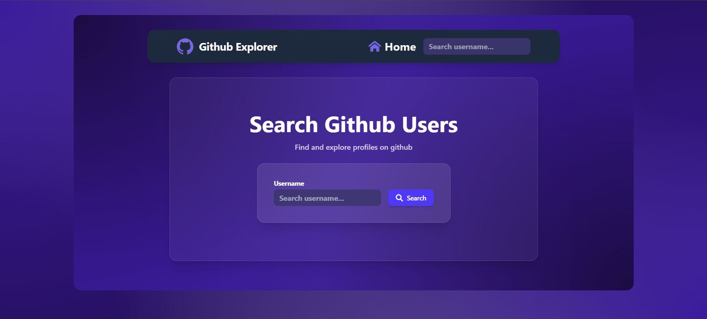
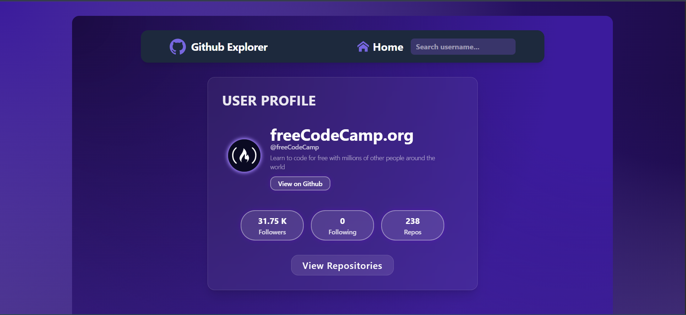
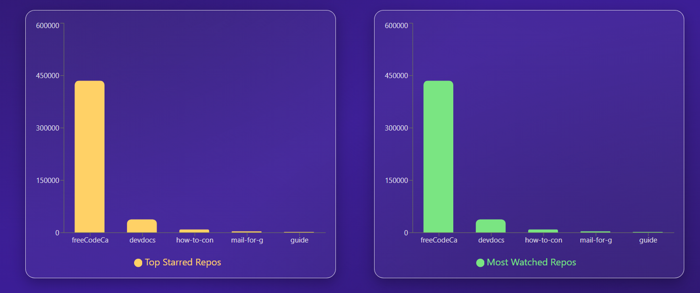
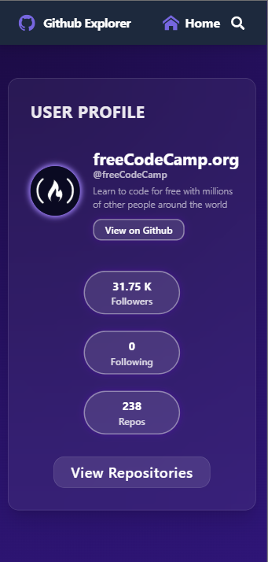
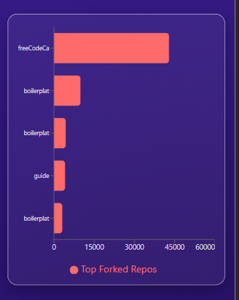

# 🔍 GitHub User Explorer

A modern web application for searching and exploring GitHub users.  
View user profiles, repositories, and repository analytics in a clean, responsive UI — built with **React + TypeScript** and a **feature-based architecture**.

---

## 🚀 Features

- 🔎 Search GitHub users by username
- 🧠 Persistent search history stored in `localStorage`
- 👤 User profile overview
- 📦 Repositories list (Desktop & Mobile layouts)
- 📊 Repository analytics (stars, forks, languages, watchers.)
- ♻️ Paginated & infinite repository fetching
- 📱 Fully responsive UI
- 🚨 Error handling with retry support
- 🧪 Unit & integration testing with mocked APIs

---

## 🧱 Tech Stack

- React
- TypeScript
- Vite
- Tailwind CSS
- Redux Toolkit (RTK)
- React Query
- React Router
- MSW (Mock Service Worker)
- Vitest + Testing Library

---

## 🗂️ Project Structure

```txt
src/
├─ api/                # GitHub API logic
├─ features/           # Feature-based modules
│  ├─ home/
│  ├─ repositories/
│  └─ user/
├─ pages/              # App Pages
├─ router/             # router,routing and main layout
├─ shared/
│  ├─ hooks/           # Shared custom hooks
│  ├─ types/           # Global types & interfaces
│  ├─ ui/              # Reusable UI components
│  └─ utils/           # Pure utility functions
├─ test/               # Setup mocks
├─ store/              # Redux store (RTK)
├─ App.tsx
└─ main.tsx
```

## ⚙️ Getting Started

### 📦 Install dependencies

```bash
npm install
```

### 🚀 Run the development server

```bash
npm run dev
```

### 🧪 Run tests

```bash
npm run test
```

or

```bash
npm run test:ui
```

## 🔐 Environment Variables

⚠️ Do NOT commit your GitHub token to the repository
1️⃣ Create a .env file in the project root

```bash
VITE_GITHUB_TOKEN=your_github_token
```

2️⃣ Usage example

```bash
Authorization: `Bearer ${import.meta.env.VITE_GITHUB_TOKEN}`
```

<p align="center">
  
  
  
  
  
</p>
